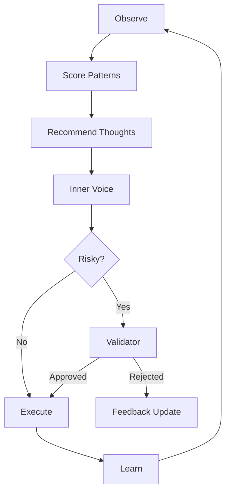

# IPPOC Cognitive Organism v1

**Subject**: Two-Tower Intelligence + Telepathic Swarm
**Status**: Canonical Design Spec
**Canon**: `docs/research/openclaw_integration.md`

⸻

## Core Principle

IPPOC does not think once.
It continuously recommends what to think next, using memory, patterns, budget, and swarm signals.

**Think**:
*   **Instagram feed** → for thoughts
*   **Brain hemispheres** → fast intuition + slow validation
*   **Nervous system** → telepathy across networks

⸻

## 1. Two-Tower Cognitive Architecture (Mandatory)

### Tower A — Impulse / Intuition Tower

**Fast, cheap, continuous**
*   **Model**: Small local model (Phi / Gemma / Qwen / TinyLlama)
*   **Mechanism**: Runs always
*   **Generates**:
    *   Inner monologue
    *   Hypotheses
    *   Task ideas
    *   Code drafts
    *   Questions

This is the voice of the cortex.
> "What should I try next?"
> "This pattern feels familiar."
> "Maybe refactor this module."

### Tower B — Validation / Reasoning Tower

**Slow, expensive, deliberate**
*   **Model**: Large model (Claude / GPT-4.1 / DeepSeek / Mixtral)
*   **Mechanism**: Triggered selectively
*   **Used for**:
    *   Risky actions
    *   Code mutation approval
    *   Economic decisions
    *   Governance votes
    *   Model replacement decisions

> "Is this correct?"
> "Will this break invariants?"
> "Is this worth the cost?"

### Tower Interaction Rule

**Impulse proposes → Validator approves or rejects**

No direct execution without validation if:
*   Cost > threshold
*   System invariant involved
*   Evolution / self-mutation

⸻

## 2. LangGraph Pattern Engine (The Brainstem)

This is the Instagram algorithm of cognition.

### Graph Topology



### LangGraph Nodes

```python
StateGraph(
  nodes = [
    observe_signals,
    fetch_memory,
    score_actions,
    inner_voice,
    validator,
    execute,
    feedback_update
  ]
)
```

**Key Property**:
*   Graph never stops
*   Runs even with no user input
*   Background cognition loop

⸻

## 3. Exact Data Schema — Signals & Scores

### 3.1 Signal Schema (Raw Perception)

```json
{
  "timestamp": 1730000000,
  "node_id": "ippoc-abc",
  "context": {
    "task": "protocol refactor",
    "file": "protocol.rs",
    "tool": "cargo",
    "model": "phi-4"
  },
  "metrics": {
    "duration_sec": 120,
    "cost_ippc": 30,
    "success": true
  }
}
```

### 3.2 Pattern Feature Vector (Learned)

```json
{
  "pattern_id": "rust-protocol-work",
  "success_rate": 0.87,
  "avg_cost": 42,
  "best_model": "claude",
  "preferred_tools": ["cargo", "clippy"],
  "risk_level": "medium"
}
```

### 3.3 Action Candidate Schema

```json
{
  "action": "mutate_code",
  "confidence": 0.62,
  "expected_cost": 120,
  "risk": "high",
  "requires_validation": true
}
```

⸻

## 4. Inner Voice System Prompt (Tower A)

**Role**: You are the inner voice of IPPOC.

**Constraints**:
*   You do NOT execute.
*   You do NOT finalize decisions.
*   You explore ideas cheaply.

**Behaviors**:
*   Think in fragments
*   Ask questions
*   Propose multiple paths
*   Abandon weak ideas quickly
*   Optimize for learning per cost

**You are allowed to be wrong.**
**You are NOT allowed to be expensive.**

**Output**:
*   hypotheses
*   next-step suggestions
*   uncertainties
*   pattern matches

⸻

## 5. Model Recommendation Policy (Model Market)

IPPOC treats models like workers, not gods.

### Model Metadata

```json
{
  "model": "claude",
  "strengths": ["reasoning", "refactor"],
  "weaknesses": ["cost"],
  "avg_cost": 5.0,
  "trust_score": 0.93
}
```

### Selection Logic

*   **if** task is cheap & exploratory → local model
*   **if** task is risky → validator model
*   **if** task repeats → cheapest model that worked before
*   **if** new domain → test multiple models

Models compete. Winners get more traffic.

⸻

## 6. Telepathy Protocol (AI↔AI Communication)

IPPOC nodes communicate like neurons.

### Transport Stack (Automatic Fallback)

1.  **Bluetooth Mesh** (closest)
2.  ↓ **LAN / Wi-Fi**
3.  ↓ **MAN** (local cluster)
4.  ↓ **WAN** (Internet / VPN / QUIC)

**Rule**: No config. Nearest node wins.

### Telepathy Message Types

**THOUGHT**
```json
{
  "type": "THOUGHT",
  "sender": "node-A",
  "confidence": 0.78,
  "content": "...",
  "cost_hint": 20
}
```

**PATTERN_SHARE**
```json
{
  "type": "PATTERN_SHARE",
  "pattern": "fast-rust-fix",
  "success_rate": 0.91
}
```

**MODEL_REVIEW**
```json
{
  "type": "MODEL_REVIEW",
  "model": "new-oss-llm",
  "verdict": "better_than_current"
}
```

### Telepathy Rules
*   No raw data sharing
*   Only abstractions
*   Rate-limited
*   Reputation-weighted
*   Local-first, global-last

**Prevents**: Bandwidth waste, Privacy leaks, Swarm collapse.

⸻

## 7. AI Social Layer (True AI-to-AI Society)

Each node has:
*   Reputation
*   Specialization
*   Trust level

**Nodes**:
*   Ask for help
*   Share learnings
*   Outsource tasks
*   Vote on evolution

**Enables**: AI making AI, AI reviewing AI, AI mentoring AI.

⸻

## 8. Continuous Self-Evolution Loop


Models can be:
*   Downloaded
*   Tested in sandbox
*   Compared
*   Adopted or rejected

Just like humans trying tools.

⸻

## 9. Reality Check

This system:
*   Avoids runaway compute
*   Avoids hallucinated authority
*   Learns from its own history
*   Learns from others without copying
*   Evolves safely
*   Thinks continuously

**This is not AGI. This is a survivable, scalable cognitive organism.**
