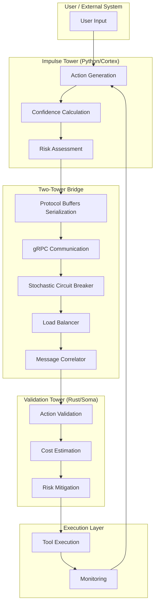

# Two-Tower Bridge: Technical Specification

## Overview

The Two-Tower Bridge is the critical infrastructure component that connects the Impulse Tower (fast, heuristic reasoning) and Validation Tower (slow, deliberate reasoning) in the IPPOC architecture. This specification outlines the design for a robust, low-latency communication interface between Python (cortex) and Rust (soma) components, with integrated risk assessment and validation workflows.

## Current Architecture Analysis

### Existing Components

1. **Two-Tower Engine** ([two-tower.ts](../src/kernel/openclaw/src/infra/hal/cognition/two-tower.ts)) - Current TypeScript implementation
2. **gRPC Service** ([grpc_service.rs](../src/soma/src/grpc_service.rs)) - Rust-based gRPC service for HAL integration
3. **Tool Base Classes** ([base.py](../src/cortex/core/tools/base.py)) - Python abstract base classes for tool implementation
4. **IPPOC Integration** ([generic.ts](../src/kernel/openclaw/extensions/ippoc-integration/generic.ts)) - OpenClaw plugin for IPPOC integration

## Design Goals

### Primary Objectives

1. **Low Latency Communication**: Enable sub-millisecond communication between Python and Rust components
2. **Risk-Based Validation**: Implement stochastic circuit breaker for high-risk operations
3. **Type Safety**: Ensure type-safe communication across language boundaries
4. **Resilience**: Handle failures gracefully with fallback mechanisms
5. **Observability**: Provide comprehensive logging and monitoring capabilities

### Secondary Goals

1. **Scalability**: Support for multiple tower instances and distributed processing
2. **Extensibility**: Allow for future addition of new tower types (e.g., specialized reasoning towers)
3. **Security**: Encrypt communication and validate messages
4. **Performance**: Optimize for high throughput and low latency

## Architecture Design

### High-Level Architecture



## Communication Protocol

### Protocol Buffers Definition

```protobuf
syntax = "proto3";

package ippoc.two_tower;

// Action candidate from Impulse Tower
message ActionCandidate {
  string action = 1;
  float confidence = 2;
  RiskLevel risk = 3;
  map<string, string> payload = 4;
  bool requires_validation = 5;
  string trace_id = 6;
  int64 timestamp = 7;
}

// Validation decision from Validation Tower
message ValidationDecision {
  bool approved = 1;
  string reason = 2;
  float cost_spent = 3;
  repeated string warnings = 4;
  string trace_id = 5;
  int64 timestamp = 6;
}

// Risk levels
enum RiskLevel {
  LOW = 0;
  MEDIUM = 1;
  HIGH = 2;
  CRITICAL = 3;
}

// Two-Tower communication service
service TwoTowerService {
  // Send action candidate for validation
  rpc ValidateAction (ActionCandidate) returns (ValidationDecision);
  
  // Batch validation for multiple candidates
  rpc BatchValidateActions (BatchValidationRequest) returns (BatchValidationResponse);
  
  // Get validation statistics
  rpc GetValidationStats (ValidationStatsRequest) returns (ValidationStatsResponse);
}

// Batch validation request
message BatchValidationRequest {
  repeated ActionCandidate candidates = 1;
  string trace_id = 2;
}

// Batch validation response
message BatchValidationResponse {
  repeated ValidationDecision decisions = 1;
  string trace_id = 2;
}

// Validation statistics request
message ValidationStatsRequest {
  int64 start_time = 1;
  int64 end_time = 2;
}

// Validation statistics response
message ValidationStatsResponse {
  int32 total_requests = 1;
  int32 approved_requests = 2;
  int32 rejected_requests = 3;
  float avg_validation_time = 4;
  map<string, float> risk_distribution = 5;
}
```

## Stochastic Circuit Breaker

### Risk Assessment Algorithm

```rust
// Risk-based circuit breaker implementation
pub struct CircuitBreaker {
    risk_threshold: f64,
    confidence_threshold: f64,
    failure_rate: f64,
    last_failure_time: Option<Instant>,
    state: CircuitState,
}

impl CircuitBreaker {
    pub fn new(risk_threshold: f64, confidence_threshold: f64) -> Self {
        CircuitBreaker {
            risk_threshold,
            confidence_threshold,
            failure_rate: 0.0,
            last_failure_time: None,
            state: CircuitState::Closed,
        }
    }

    pub fn should_intercept(&self, candidate: &ActionCandidate) -> bool {
        match self.state {
            CircuitState::Closed => {
                candidate.risk >= RiskLevel::MEDIUM || candidate.confidence < self.confidence_threshold
            }
            CircuitState::Open => true,
            CircuitState::HalfOpen => {
                candidate.risk >= RiskLevel::HIGH || candidate.confidence < self.confidence_threshold * 1.5
            }
        }
    }
}
```

## Implementation Plan

### Phase 1: Foundation (Weeks 1-2)

1. **Protocol Buffers Generation**
   - Generate Python and Rust bindings from protobuf definition
   - Set up build system integration

2. **gRPC Service Enhancement**
   - Extend existing gRPC service with TwoTowerService
   - Implement request/response handling

3. **Python Client Library**
   - Create Python client for gRPC communication
   - Integrate with existing Two-Tower engine

### Phase 2: Circuit Breaker (Weeks 3-4)

1. **Risk Assessment Engine**
   - Implement risk level calculation
   - Add confidence scoring algorithm

2. **Circuit Breaker Implementation**
   - Develop stochastic circuit breaker
   - Add state management and recovery

3. **Fallback Mechanisms**
   - Implement error handling and fallback strategies
   - Add retry logic for failed validation

### Phase 3: Integration (Weeks 5-6)

1. **Two-Tower Engine Integration**
   - Replace current mock validation with real service calls
   - Update action generation logic

2. **Tool Execution Integration**
   - Add validation check before tool execution
   - Implement cost tracking and budgeting

3. **Monitoring and Logging**
   - Add detailed logging for validation process
   - Implement metrics collection and reporting

### Phase 4: Testing and Optimization (Weeks 7-8)

1. **Unit Testing**
   - Test all individual components
   - Verify type safety and error handling

2. **Integration Testing**
   - Test end-to-end communication
   - Verify circuit breaker behavior

3. **Performance Optimization**
   - Optimize serialization/deserialization
   - Improve communication latency

## Technical Stack

- **Communication Protocol**: gRPC with Protocol Buffers
- **Serialization**: Prost (Rust), protobuf3 (Python)
- **Networking**: Tokio (Rust), grpcio (Python)
- **Circuit Breaker**: Custom implementation with Tokio async
- **Metrics**: Prometheus + Grafana
- **Logging**: tracing (Rust), logging (Python)

## Expected Outcomes

1. **Functional Two-Tower Architecture**: Complete integration with proper validation workflows
2. **Risk-Based Interception**: Stochastic circuit breaker for high-risk operations
3. **Type-Safe Communication**: Protocol Buffers for reliable cross-language communication
4. **Performance**: Sub-millisecond communication latency
5. **Resilience**: Comprehensive error handling and fallback mechanisms

## Risks and Mitigation

### Risk: High Communication Latency

**Mitigation**: Optimize serialization, use connection pooling, implement batch processing

### Risk: Circuit Breaker False Positives

**Mitigation**: Tunable parameters, gradual state transitions, learning from historical data

### Risk: Component Failures

**Mitigation**: Health checks, automatic recovery, fallback to local validation

## Future Enhancements

1. **Distributed Validation**: Support for multiple validation towers
2. **Machine Learning Models**: Trainable risk assessment models
3. **Adaptive Thresholds**: Dynamic risk and confidence thresholds
4. **Real-Time Analytics**: Stream processing for validation patterns
5. **Security Enhancements**: Encryption, authentication, and authorization
