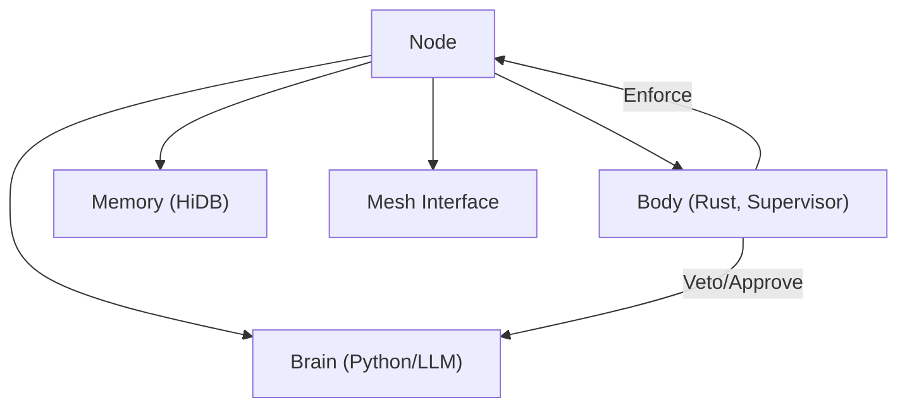

# 01_NODE_DEFINITION.md

## 1. Atomic Definition
A Node is the atomic, sovereign execution unit of IPPOC-OS. It is independently bootable, killable, evolvable, cryptographically identifiable, and economically isolated.

## 2. Shared Responsibilities
1. Maintain its own safety.
2. Perform its assigned cognitive role.
3. Preserve local memory integrity.
4. Communicate abstract knowledge.
5. Obey invariants.

## 3. Identity Model
- **NodeID**: `Hash(device_fingerprint + process_salt + keypair + genesis_time)`.
- Identity is non-transferable, immutable, and sovereign.

## 4. Valid Node Placements
1. **One Node = One Physical Device**: Preferred for production, clear fault boundaries.
2. **Multiple Nodes = One Physical Device**: Allowed if isolated. Each must have its own process, sandbox, NodeID, memory namespace, and wallet. Treated as strangers.
3. **One Node Across Multiple Devices**: ❌ FORBIDDEN. Violates sovereignty and isolation.

## 5. Isolation Constraints
If multiple nodes exist on one host:
- Isolation MUST be explicit (namespaces/sandboxes).
- Resource caps MUST be enforced.
- Mesh treats them as remote entities.
- No implicit coordination or shared state.

## 6. Internal Architecture (Compartmentalization)

## 5. Lifecycle & Autonomy
- **Boundaries**: Nodes cannot modify invariants, override kernel limits, or force global decisions.
- **Autonomy**: Nodes can leave mesh, fork code, refuse updates, or self-terminate.
- **Lifecycle**: Birth -> Operation -> Learning -> Evolution -> Fork/Death.
