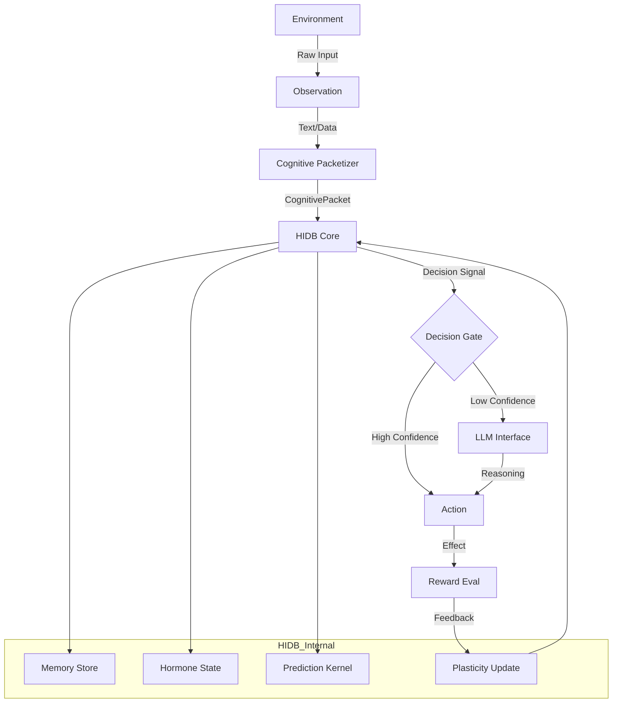

# ARCHITECTURE: LLM ↔ HIDB Interface & Agent Loop

**DATE:** 2026-01-23
**TYPE:** System Architecture / Interface Spec
**STATUS:** DRAFT
**CONTEXT:** Phase 3 Preparation

---

## 1. LLM ↔ HIDB Interface (Hard Boundary)

**Principle:**
*   **LLM:** Stateless Inference (Cortex).
*   **HIDB:** Stateful Cognition (Hippocampus/Basal Ganglia).
*   **Constraint:** They NEVER share weights. They exchange **CognitivePackets** only.

### Interface Contract
*   **Input:** `ObservationPacket` (from LLM/Env to HIDB).
*   **Output:** `IntentPacket` | `ContextPacket` | `SuppressionSignal` (from HIDB to LLM/Actor).

### Rust-Level Boundary
```rust
pub trait CognitiveInterface {
    /// LLM/Environment sends observation to Brain
    fn observe(&mut self, packet: CognitivePacket);
    
    /// LLM requests relevant memory/context
    fn query_context(&self) -> Option<CognitivePacket>;
    
    /// Environment provides reward feedback
    fn feedback(&mut self, reward: f32);
}
```

---

## 2. Cognitive Packet Encoders (Text → Brain)

**Goal:** Convert human artifacts (text, code, logs) into brain-usable signals, NOT tokens.

### Encoder Stack (External to HIDB Core)
1.  **Raw Text** (Input)
2.  **Semantic Encoder** (Small BERT/Embedding Model)
3.  **Uncertainty Estimator** (Variance/Entropy check)
4.  **Salience Estimator** (Relevance check)
5.  **CognitivePacket** (Output)

### Packet Fields
| Field | Meaning |
| :--- | :--- |
| `latent[256]` | Semantic direction (meaning, not syntax) |
| `uncertainty[256]` | Confidence distribution |
| `confidence` | Global trust scalar |
| `reward_trace` | Expected learning signal |
| `salience` | Importance weighting (Drives plasticity) |
| `modality_id` | Source type (Text/Code/Vision) |
| `timestamp` | Temporal anchor |

---

## 3. How HIDB Supervises an LLM

**Concept:** Invert the control loop. HIDB is the controller; LLM is the subroutine.

### Control Loop
1.  **Proposal:** LLM proposes output/thought.
2.  **Evaluation:** HIDB simulates outcome / checks against memory.
3.  **Modulation:** Dopamine/Cortisol levels update.
4.  **Gating:** Call is allowed, modified, or suppressed.

### Supervision Signals
*   **Dopamine ↑**: Reinforce used patterns (Habit formation).
*   **Cortisol ↑**: Penalize exploration (Risk aversion).
*   **Serotonin ↑**: Stabilize response (Patience).
*   **Adrenaline ↑**: Force exploration (Novelty seeking).

---

## 4. Reducing LLM Calls by 90%

**Logic:** Most LLM calls are redundant (recall, habit, clarification). HIDB handles these via predictive state match.

### Call Gating Logic
```python
if hidb.confidence(task) > threshold:
    # Use cached/reflexive response from HIDB Memory
    return hidb.reflex_action(task)
else:
    # High uncertainty -> Invoke high-energy Cortex (LLM)
    return llm.inference(task)
```
**Expected Reduction:** 80-95% for routine tasks.

---

## 5. Fully Autonomous Agent Loop

**The Final Architecture:**


